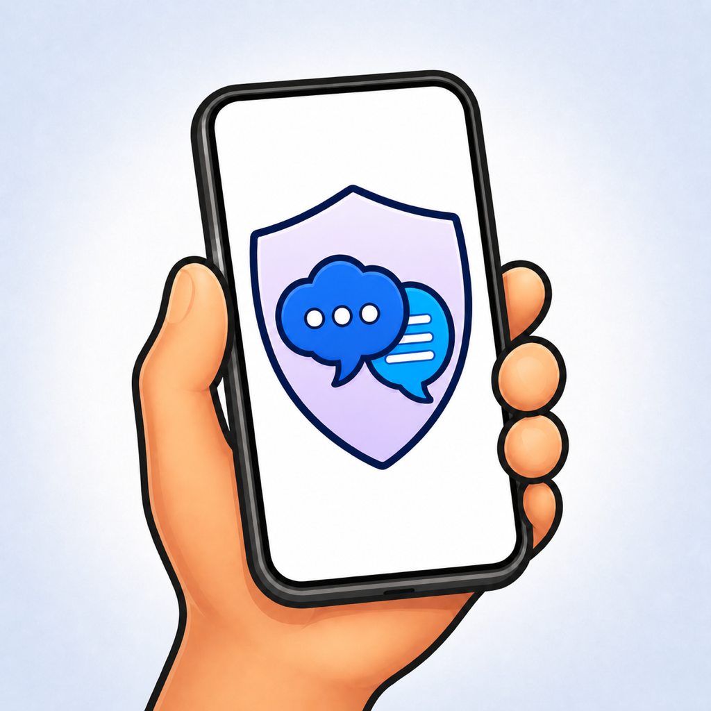
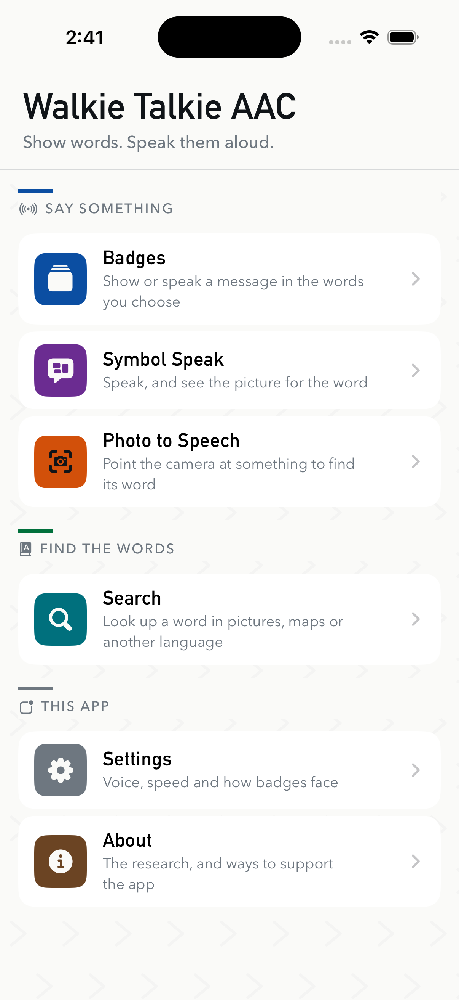
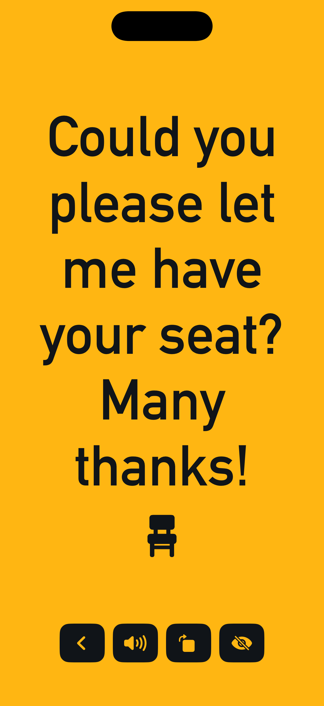

  

<h1 align="center">Walkie Talkie AAC</h1>

  A free, co-designed AAC app that turns an iPhone into an outward-facing display for everyday conversation.

  
  

  
  &nbsp;&nbsp;&nbsp;
  

Walkie Talkie helps a person use the phone they already carry as part of
face-to-face communication. Wear the iPhone on a lanyard or strap, choose a
message, and the screen presents it in large type to the person opposite. Tap
the display to speak the message aloud.

## What it does

- Displays short, customizable messages in large outward-facing type.
- Speaks any message aloud using the selected voice and language.
- Listens to live speech and shows a picture for the latest word.
- Suggests words for objects photographed with the camera.
- Includes a searchable library of more than 500 Mulberry picture symbols.
- Opens picture, map, dictionary, Wikipedia, video and web searches when a word
  is difficult to find or explain.
- Presents an aphasia explainer with practical, tappable phrases.
- Works without an account, advertising, analytics or a developer-operated
  service.

## Make the badges yours

Badges can be written and arranged in the app. Each can have its own wording,
colour, symbol, text size and spoken language. The complete collection is also
stored as readable JSON, making it easy to copy between devices or edit in
bulk.

The optional **Write badges with AI** workflow works with an assistant the user
already chooses:

1. Copy the self-contained prompt from **Badges → Write badges with AI**.
2. Paste it into an assistant and describe the badges you need.
3. Paste the reply back into Walkie Talkie and review every new or changed
   badge before saving.

The app does not connect to an AI service or hold an API key. Nothing is
changed until the proposed badges have been checked and approved.

## Co-designed for real conversations

Walkie Talkie grew from participatory design workshops with people with
aphasia and other communication needs, in partnership with
[Aphasia Re-Connect](https://aphasiareconnect.org/). The design treats the
iPhone as a wearable communication prop: readable at a glance, immediately
available and able to complement speech, gesture, eye contact and other forms
of expression.

The research behind the project is described in:

> Humphrey Curtis, Ying Hei Lau, and Timothy Neate. 2024. 
> [*Breaking Badge: Augmenting Communication with Wearable AAC Smartbadges and Displays*](https://doi.org/10.1145/3613904.3642327). 
> In the CHI Conference on Human Factors in Computing Systems (CHI '24).

## Build the app

### Requirements

- macOS with Xcode 26.6
- iOS 17.0 or later

Clone the repository, open `Walkie Talkie AAC.xcodeproj`, choose the
`Walkie Talkie AAC` scheme and run it on an iPhone simulator or device.

Signing is only required for physical devices and App Store distribution.
There are no third-party package dependencies, setup secrets or external build
steps.

## How it is organized

- `WalkieTalkieAAC/Features/` contains one SwiftUI view for each part of the
  app.
- `WalkieTalkieAAC/Model/` contains badges, local storage, import and speech.
- `WalkieTalkieAAC/Support/` contains speech recognition, camera and Vision
  classification.
- `WalkieTalkieAAC/DesignSystem/` contains the signage-inspired palette,
  typography and shared components.

Badges are stored locally as JSON. Speech is generated with
`AVSpeechSynthesizer`, images are classified with Apple's Vision framework,
and the app's own interface makes no network requests.

## Accessibility

The interface supports Dynamic Type and reflows at accessibility text sizes
instead of truncating content. It respects Reduce Motion, Increase Contrast
and Reduce Transparency, and uses large controls designed for one-handed use.

## Privacy and support

Walkie Talkie does not require an account and does not collect analytics,
advertising identifiers or personal data on developer-operated servers. See
the full [privacy policy](docs/privacy.md) and [support page](docs/support.md).

Found a problem or have an accessibility suggestion?
[Open an issue](https://github.com/HumphreyCurtis/Walkie-Talkie-AAC/issues).
Please do not include private health information in a public issue.

## Acknowledgements

Thank you to the people with aphasia, communication partners, speech and
language therapists and facilitators who shaped the project, and to
[Aphasia Re-Connect](https://aphasiareconnect.org/) (UK registered charity
1176125) for its partnership.

Picture symbols are from [Mulberry Symbols](https://mulberrysymbols.org/) by
Garry Paxton and Steve Lee, licensed under
[CC BY-SA 4.0](https://creativecommons.org/licenses/by-sa/4.0/).

Walkie Talkie AAC is free and open source. If you would like to support its
continued development, you can
[sponsor Humphrey Curtis on GitHub](https://github.com/sponsors/HumphreyCurtis)
or [donate to Aphasia Re-Connect](https://aphasiareconnect.org/ways-to-help/donate/).

## License

Source code is available under the [MIT License](LICENSE).
